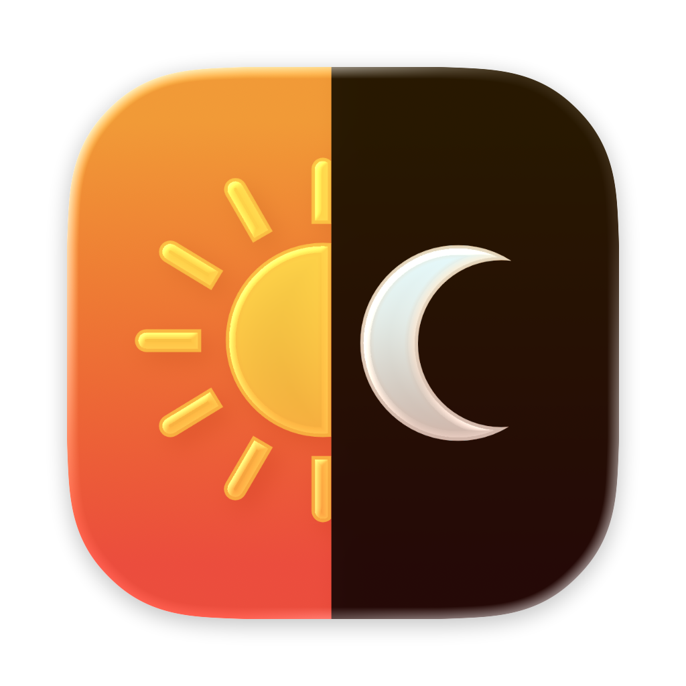
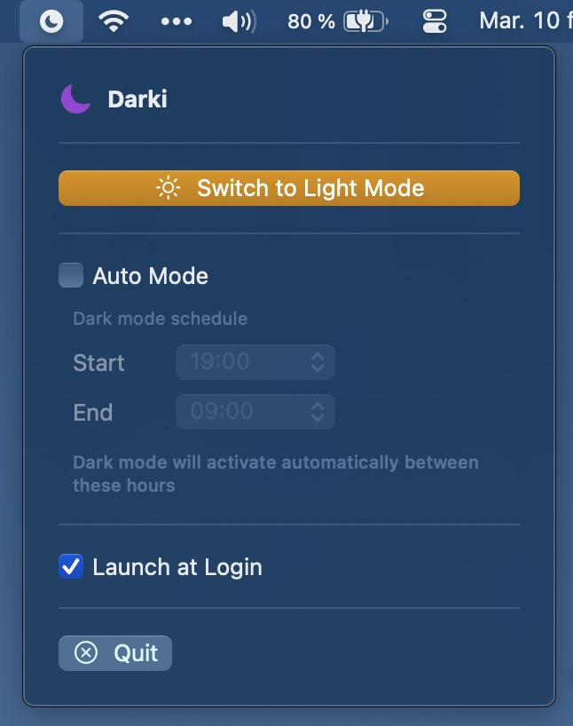

# Darki

A free and simple macOS menu bar app that automatically toggles between Light and Dark mode on a schedule.

## Features

- 🌓 Quick toggle between Light/Dark mode from menu bar
- ⏰ Auto mode: Schedule dark mode between specific hours
- 🚀 Launch at login option
- 🎨 Native SwiftUI interface for macOS

## Supported Languages

Darki is available in the following languages:

- 🇬🇧 English
- 🇫🇷 Français (French)
- 🇪🇸 Español (Spanish)
- 🇮🇹 Italiano (Italian)
- 🇩🇪 Deutsch (German)
- 🇨🇳 简体中文 (Simplified Chinese)
- 🇯🇵 日本語 (Japanese)
- 🇰🇷 한국어 (Korean)

## Requirements

- macOS 14.0 (Sonoma) or later

## Installation

1. Download the latest release from the [Releases](https://github.com/Kitround/Darki/releases) page
2. Unzip the file and move **Darki.app** to your Applications folder
3. Open Darki from your Applications folder

### macOS Security Permissions

Darki requires two permissions to function properly on macOS:

### Allow the App to Run

When you first open Darki, macOS may block it because it's not from the App Store. To fix this:

1. Go to **System Preferences > Security & Privacy > General**
2. Click **"Open Anyway"** next to the message about Darki

### Enable Automation for System Events

Darki needs permission to control System Events to toggle dark mode automatically.

**First time:** A popup should appear asking for permission when you launch Darki.

**If no popup appears:**
1. Open **System Preferences > Security & Privacy > Privacy**
2. Select **"Automation"** from the left sidebar
3. Find **Darki** in the list
4. Check the box next to **"System Events"**

Without this permission, Darki cannot change your system's appearance settings.

## License

MIT License - feel free to use and modify!
